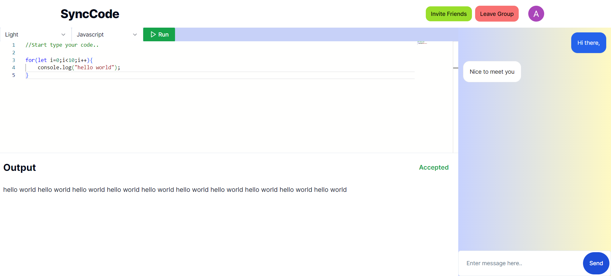

<p align="center">


</p>

## 💥 Introduction

CodeXF is a dynamic platform designed to enhance your coding experience with real-time collaboration, integrated communication tools, and a fast code compiler.


## Features
- **Real-time Code Collaboration**: Work on the same codebase with your team in real-time, ensuring everyone stays in sync.
- **Integrated Chat and Voice Communication**: Discuss ideas, troubleshoot issues, and provide feedback without leaving the platform.


- **Fast Code Compiler**: Write, test, and debug your code swiftly with our fast compiler, providing immediate feedback for continuous improvement.

## Motive Behind CodeXF

CodeXF was created to address the common challenges when  we faced during traditional coding collaboration. Our aim is to:

- ** Reduce Screen Sharing ** : Unlike traditional methods that rely heavily on screen sharing, CodeXF enables direct interaction with the codebase, making collaboration more efficient and less cumbersome
- ** Real-time Updates ** : Traditional software often lacks real-time updates, leading to version conflicts and delays. CodeXF ensures all changes are reflected instantly, keeping everyone on the same page
- ** Educational Tool ** : CodeXF is also an excellent tool for teaching code, allowing students to access and run code in real-time. This hands-on approach enhances learning and provides immediate feedback, making it ideal for educational settings.

## Getting Started

1. **Sign Up**: Create an account on through Google Auth.
2. **Create or Join a Groups**: Start a new Group or join an existing one.
3. **Collaborate**: Use our real-time editor and integrated communication tools to work with your team.
4. **Compile and Test**: Utilize our fast compiler to write, test, and debug your code.

## Tech Stack used in CodeXF
- [Nextjs](https://nextjs.org/)
- [Expressjs](https://expressjs.com/) , [Socket.io](https://socket.io/)
- Aiven  - [cloud redis service ](https://aiven.io/)
- zegocloud for voice commiuncation - [click here](https://www.zegocloud.com)
- Judge0 for code compilation

## 🛠️ Local development
### Clone the Repository

To get started with CodeXF, clone the repository to your local machine:

```sh
git clone https://github.com/ajaysehwal/CodeXF.git
cd CodeXF
```
### Run CodeXF Locally
```sh
 yarn xf:install or npm run xf:install
 yarn xf:dev or npm run xf:dev
```
Now we will add the environment variables in the web/ and server/

- Create a .env file in both web and server folder according to .example.env given in both the folders respectively.

## Contact

For support or inquiries, please contact us at [support@ajaysehwal.dev@gmail.com](mailto:ajaysehwal.dev@gmail.com).

